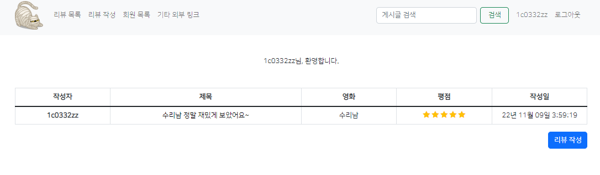
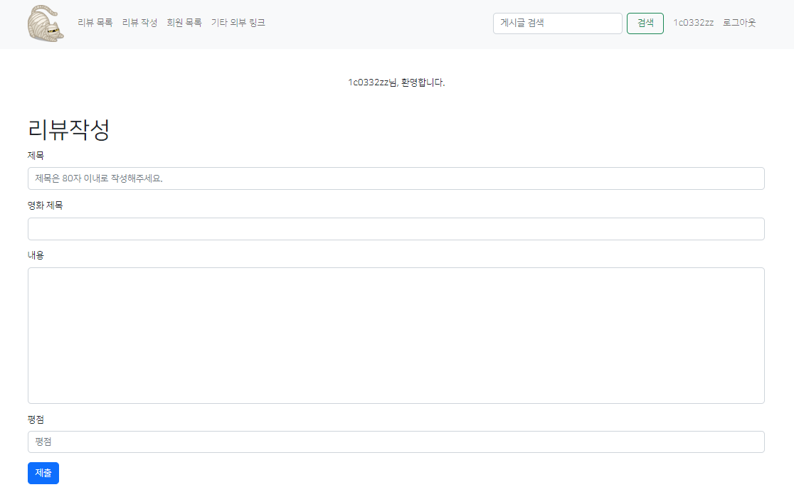
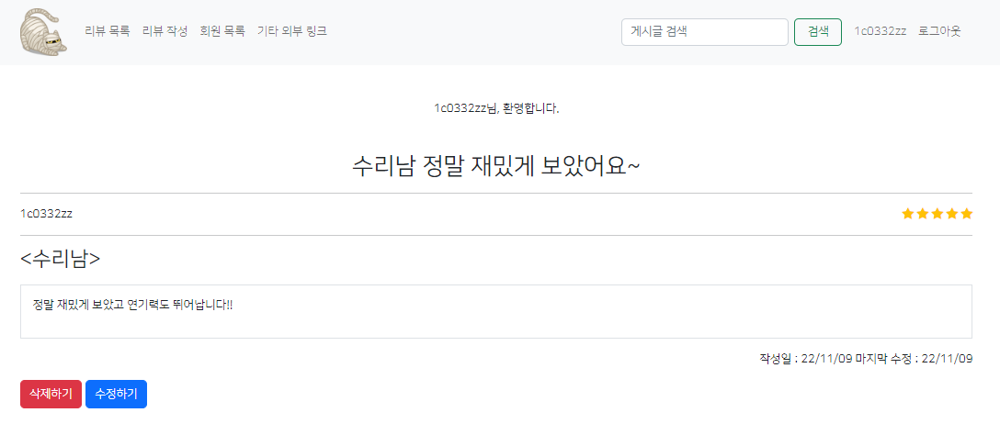
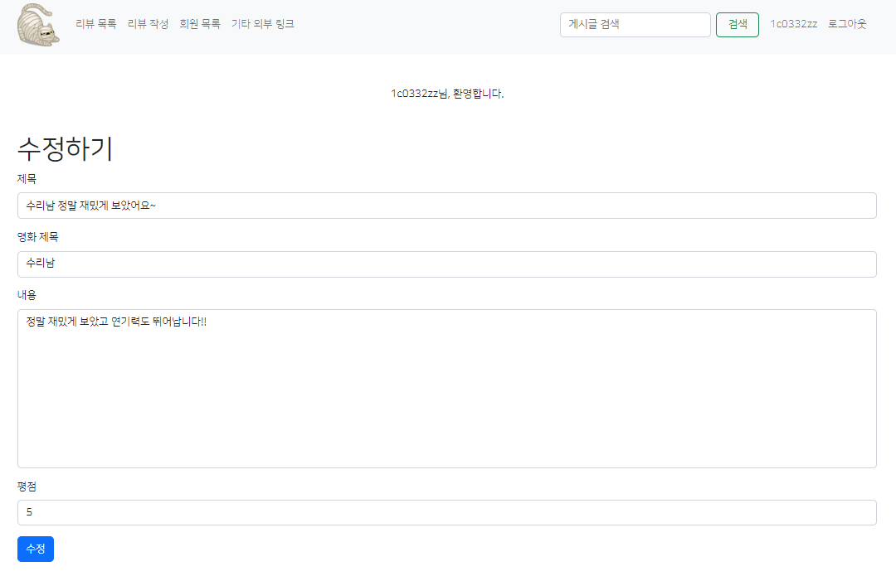
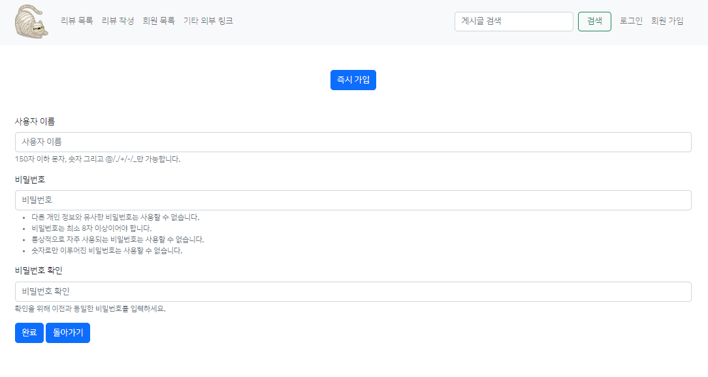

# **🍔 서비스 소개**

> 영화의 리뷰와 평점 및 회원가입을 남길 수 있는 웹사이트 입니다.

## **🎮 기능**

1. 메인

2. 글 작성

3. 글 상세보기

4. 수정하기

5. 회원가입

## 🎉소감

* 간단한 CRUD 및 회원가입과 검색 등이 가능한 웹 사이트를 만들어 보았습니다.
* 로그인이 되었을 때만 할 수 있는 기능들에 대해 토큰 없이는 접근하지 못하도록 막는 식으로 코드를 구성하였다.
* 평점을 아이콘으로 구현하는 면에서 많이 헤맸는데 for i in x | range_ 기능으로 해결 할 수 있었다.
* 검색 기능도 https://stackoverflow.com/questions/739776/how-do-i-do-an-or-filter-in-a-django-query를 참고하여 구현 할 수 있었다.